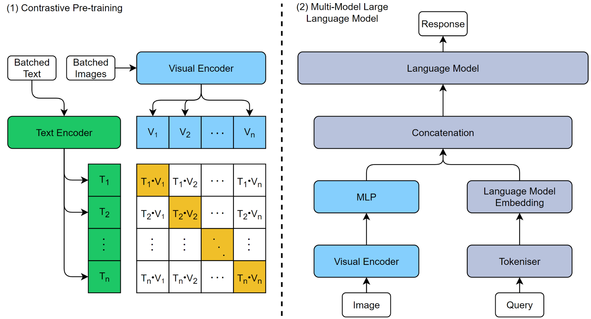

# Project Outline

The aims, objectives, and research questions for this project are outlined in the [Project Outline](plan.md).

# Overview

This project provides adaptations of the transformers library code to facilitate the training of an MLLM for purposes of medical Visual Question Answering (VQA) tasks. Early works pretrained a visual encoder through Contrastive Language Image Pretraining (CLIP); however, this was later changed to use the pretrained CLIP model from OpenAI. Through feature alignment by a Multi-layer Perceptron, the embedded representation of the image is projected to an embedding space recognizable by a pre-trained Large Language Model (LLM). The original model architecture can be seen below:

# Project Progress Notes

Welcome to the project’s weekly progress updates. Here, you’ll find summaries of work completed, challenges encountered, and plans for the upcoming weeks.

## Weekly Progress

- [Week starting 18-11-24](week-18-11-24.md)
- [Week starting 25-11-24](week-25-11-24.md)
- [Week starting 09-12-24](week-09-12-24.md)
- [Week starting 06-01-25](week-06-01-25.md)
- [Week starting 20-01-25](week-10-01-25.md)

Each link above provides details for that week’s work.