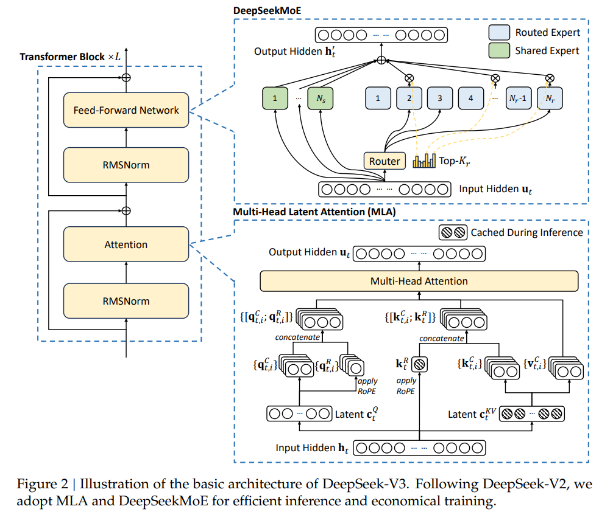
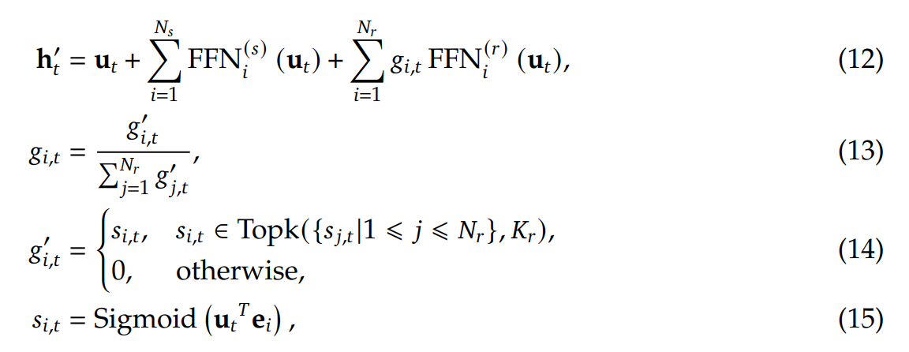
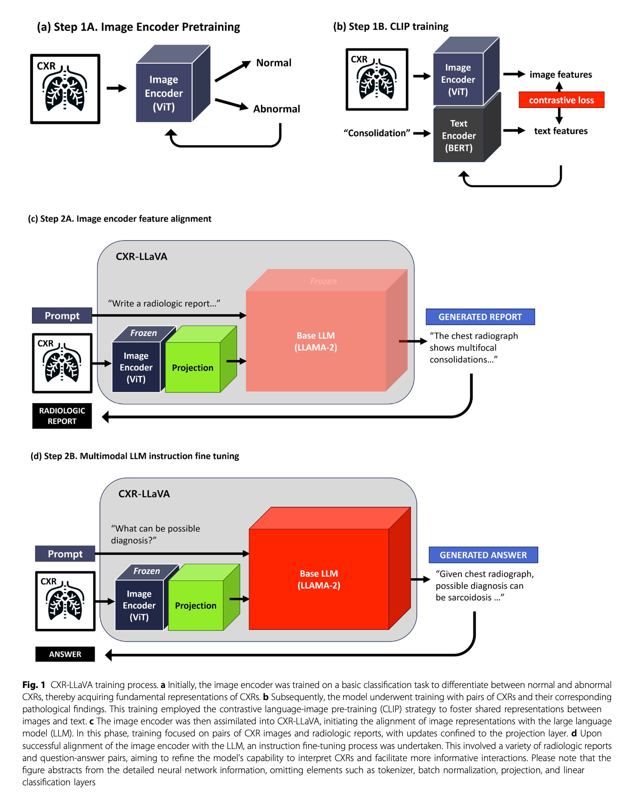
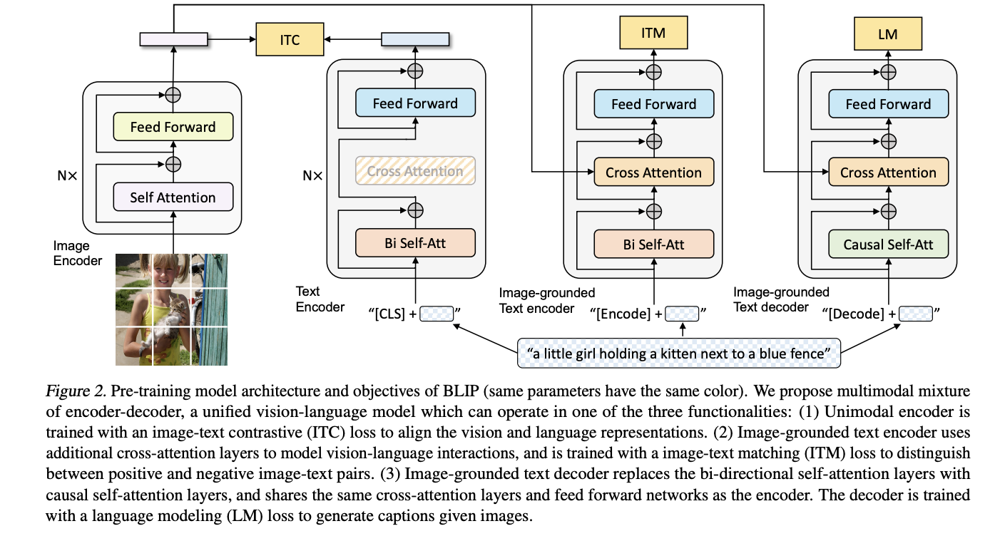

# Week Progress

**Date**: 2025-02-03 to 2025-02-07

## Overview

- DeepSeek was explored further
- Medical papers from the literature review from week 2025-01-25 have been explored further to:
    - Assess if they use a pre-trained vision encoder and LLM connected through a type of projection module
    - And if they have to see how they performed their embedding alignment

## DeepSeek-V3

- Mixture-of-Experts (MoE): 671B total parameters, but only 37B active per token.

- Expert Selection: Uses 8 out of 256 experts plus shared experts.

- Gating Network: Dynamically routes inputs to the most relevant experts:

- Multi-Head Latent Attention (MLA): Reduces memory usage while maintaining efficiency

## Embedding Alignment in Medical MLLMs

- No papers found leveraged non-medical data to further alignment tuning

- Of the 25 medical papers, 8 were considered irrelevant for the following reasons:

    - 1: for training a transformer for VQA as classification not language generation
    - 2: for leveraging pre-made models without training them, integrating them into systems to explore real-world use
    - 1: for evaluating GPTs
    - 2: for not using Large Language Models (LLMs)
    - 1: used cross-modal reasoning as a classifier
    - 1: for being a review on the practicalities of using MLLMs in dentistry.

- Of the remaining 17, some noteworthy papers:

**With Explicit Alignment Training**

### CXR-LLaVA*
Architecture:
    Visual: ViT-L/16
    LLM: Llama-2 7B
    Connection: MLP projection
Alignment Strategy:
        Phase 1: Train projection only
        Phase 2: LoRA + projection training

### PLAMi

[PLAMi Paper](https://link.springer.com/article/10.1007/s00371-024-03742-3)

Architecture:
    - Visual: BioMEDCLIP
    - LLM: SevMistral-7B
    - Connection: MLP projection
Alignment Strategy:
    - Trains just the MLP projection and then trains all of the modules together

**Without Explicit Alignment:**

### ClinicalBLIP
[ClinicalBLIP Paper](https://pmc.ncbi.nlm.nih.gov/articles/PMC11238846/pdf/nihms-1979510.pdf)

[BLIP Paper](https://arxiv.org/pdf/2201.12086)

Architecture:
    - A fully intergrated Multi-modal language model, trained with:
        - image-text contrastive (ITC) loss
        - image-text matching (ITM) loss
        - language modeling (LM) loss 
    - No explicit alignment phase

## Accomplishments

- Identified methods used for embedding alignment in medical MLLMs
- Reviewed the DeepSeek architecture in detail and researched the reinforcement learning method used to produce DeepSeek-R1-Zero,
    to explore the potential of using R1-Distilled models in MLLM alignment tuning and MLLM instruction tuning