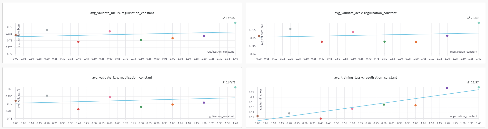

# Week Progress

**Date**: 2025-03-03 to 2025-03-07

## Overview
- The LLM draws out the domain specific information with the MLP projection. This helps it to leverage its understanding and acheve a better accuracy.
- However this results in information the LLM could use is being disregarded.
- We remove this by applying a cosine simularity to reconstructed embeddings after the projection, adding the loss to the original.

## Other Ideas:

  - Due to the fact that the MLP clearly is benifitting the LLM in processing information.  We could try adding some larger more complex model as well as oor along side the orginal embeddings:
    - the orghinal would make the model generalisable and the extra proocessing of the emeddings would improve the MLLMs ability?

  - Could also try MoE on the embeddings?

  Quesitions?

  - Do Qformers have this same issue? And is the MLP acting as a bad qformer, i.e selecting information that is helpfull to the most likely query?
  - Can we improve this like the QFormers do but without using the query?

## Regulerisation Results so far

## Loss

- As the reg parameter increases the loss also increases. This means that the cosine simularity could not be being otimised as well, in which case the dimentionality reduction is resulting in most of the information loss.
- It sould indicate that as the projection becomes better at reconstructing the orginal embeddings that the projection is no longer able to effectivilly preporcess the embeddings for the LLM. This is less likly as we see the accuracy increasing with the reg parameter, even if it is only slight.

## If the cosine loss is not able to decrease:

- It tells us that the LLM is not able to unprocess information that is compressed? Requiring extra help to make the embeddings better:
  - Could try taking the embeddings and spreading them across more embedding tokens, i.e increating the avalable information the proejcitons can provide. i.e one image embedding gets projected to two LLM embeddings?

## Accuracy

- A slight trend in the increase of the accuracy with a higher regularisation constant is shown.
- Once the constant is increased, hopefully we will see more consistent results.
- At the begining of training g the loss is much higher,> 6.0. The reg loss by comparison can only be between 0.0 and 2.0. we may only see a better trend when we increase the constant further.
- One of the issues we are trying to solve is the LLM infulences the projection very early, and causes loss of information it may benifit from later, i.e the projection is in a local mininum.

## Issues

- The cosine simularity does not take magnitude into acount and only calulates the angles between the embedings. Embeddings need to be normilised as to not effect the gradient?

## Accomplishments

## Plans for Next Week

- Record the two losses to see which causes more issues

- 
