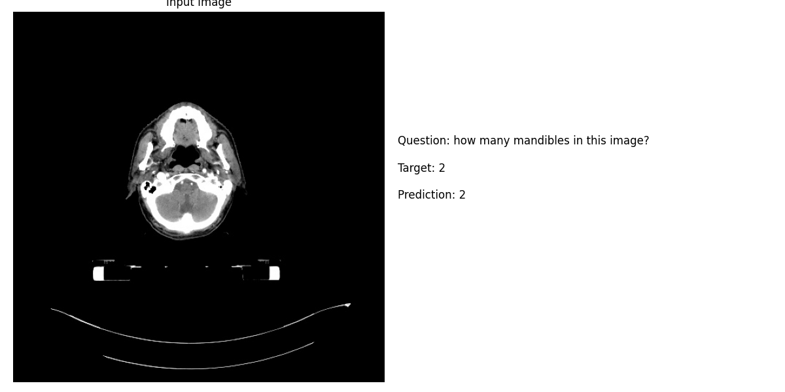

# Week Progress

**Date**: 2025-01-06 to 2025-01-10

## Overview

Testing for the new model was conducted.

### Test Results

| Metric | Overall | CLOSED | OPEN |
|--------|---------|---------|-------|
| Accuracy | 0.7340 | 0.7398 | 0.7337 |
| BLEU1 | 0.7725 | 0.7726 | 0.7761 |
| F1 | 0.7795 | 0.7781 | 0.7840 |
| Loss | 2.3036 | 1.8465 | 2.5986 |
| Precision | 0.7847 | 0.7821 | 0.7900 |
| Recall | 0.7788 | 0.7774 | 0.7832 |

## Examples

## Accomplishments

Successfully tested the MLLM model on medical image dataset:
   - Achieved 73.4% overall accuracy
   - Strong performance on both CLOSED (74.0%) and OPEN (73.4%) questions
   - High BLEU scores indicating good response quality

## Plans for Next Week
