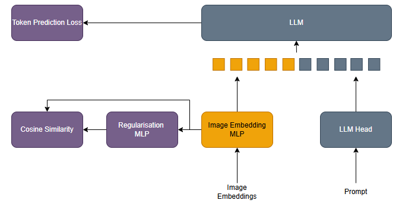

# Week Progress

**Date**: 2025-03-10 to 2025-03-15

## Overview

The initial idea was to enforce the loss:

   
cos(x, P1(x)) = (x · P1(x)) / (||x|| · ||P1(x)||)

Where:

- 
x is the original image encoding (from a vision encoder like CLIP, ViT, etc.)

- 
P1(x) is the projected embedding in the LLM token space

- 
The dot product x · P1(x) measures alignment between vectors

- 
||x|| and ||P1(x)|| are the L2 norms of the respective vectors

This was meant to prevent excessive transformation: Ensures that the MLP doesn't distort features too far that they could not be recovered. Regularising the LLMs effect on selecting relevant information.
However, this ran into some inconsistent results, with only minor improvements.

The MLLM takes an image encoding and then projects it with an MLP to the LLM embedding space. We create a loss from the LLM token prediction loss. We add this loss to another, the cosine similarity between the projected image encoding and the projected image encoding projected again by another MLP projection.

   
Lcos = 1 - (P1(x) · P2(P1(x))) / (||P1(x)|| · ||P2(P1(x))||)

The new approach avoids forcing the LLM space to match the vision space, which might have limited adaptation. Instead, it stabilizes the learned embeddings within the LLM's space, allowing them to be more structured and useful for token prediction. Which is critical for reasoning tasks like VQA.

# Regularising MLLM Alignment through Cosine Constrainment

LCos = 1 - (x · P1(x)) / (||x|| · ||P1(x)||)

L = LTP + &lambda;LCos

## Results

# Regularising MLLM Alignment through Self-Distillation

    
LCos = 1 - (P1(x) · P2(P1(x))) / (||P1(x)|| · ||P2(P1(x))||)

    
L = LTP + &lambda;LCos

- 
P1(x) the image embeddings projected to the LLM embedding space

- 
P2(P1(x)) the image embeddings in the LLM embedding space regularised

## Strengthening Visual-Language Alignment

The model projects the image encoding into the LLM embedding space using an MLP projection layer. However, raw image encodings might not be perfectly aligned with the LLM token space. The additional cosine similarity loss forces the projected image embeddings to be more consistent and structured in the LLM's learned space. This means the projected image features become more compatible with text embeddings, making it easier for the LLM to use them for reasoning. This reduces the modality gap between vision and language, leading to better VQA performance.

## Regularization

- First projection: Image encoding projected into the LLM embedding space.
- Second projection: The already projected embedding again projected with another MLP.

By enforcing cosine similarity between these two representations, a form of regularization is introduced that stabilizes the learned image representations. This:

- Encourages consistency in the projected image representations.
- Prevents the MLP from mapping image features into a space that is too arbitrary.
- Forces the projections to preserve key semantic features across multiple transformations.

This prevents the model from overfitting to spurious correlations and encourages it to focus on salient visual features relevant to language-based reasoning.

## Inducing Better Image Representations for LLM Tokens

The primary LLM token prediction loss encourages image features to be useful for text-based reasoning. However, by adding the cosine similarity loss:

The projected visual embeddings remain structured in a way that preserves their original semantic meaning.
The model doesn't collapse into trivial solutions where the image embeddings lose their meaningful relationships when projected into text space.
This results in more accurate text predictions based on image inputs, which is crucial for VQA.

## Avoiding Information Degradation in Projection Layers

When using an MLP projection, there's a risk that the mapping loses information due to:

- Overfitting to training data (causing poor generalization).
- Collapsing embeddings to a low-rank subspace that lacks useful features (The LLM embedding space in this case is much larger 768 vs 2048).

By introducing the cosine similarity loss, you force the projected embeddings to retain structure, making it easier for the LLM to use the image information effectively.
## But why? Enforcing Representation Consistency

By adding a cosine similarity loss between P1(x) and P2(P1(x)), self-consistency is enforced in the learned embeddings.

This means that:
1. P1(x) represents the first projection from image encoding space to LLM embedding space
2. P2(P1(x)) represents the second projection applied to the already projected embedding

The cosine similarity loss Lcos = 1 - (P1(x) · P2(P1(x))) / (||P1(x)|| · ||P2(P1(x))||) ensures that the two projections maintain structural consistency.

When minimized, this loss encourages:
- P1(x) to produce embeddings that are robust to further transformation
- P2 to preserve the semantic structure of P1(x)
- The entire pipeline to learn stable, information-preserving projections
# Results

## Validation Accuracy

## Embeddings consistency

## Other works

https://arxiv.org/pdf/2105.04906

https://arxiv.org/pdf/2407.04600v1

Other models preserve this consistency through attention mechanisms like flamingo using a gated cross-attention module to align visual tokens with LLM embeddings