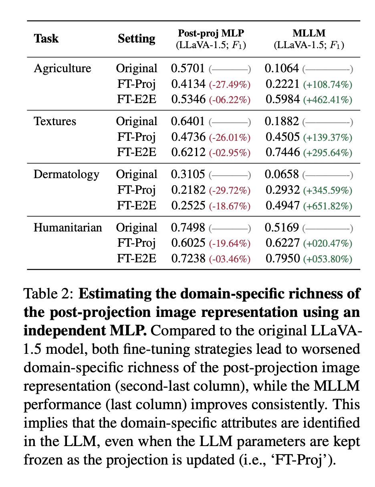

# Week Progress

**Date**: 2025-02-17 to 2025-02-21

## Overview

The 3-stage program training implementation is now running on aire. Some issues with the dataset were noted as the sacle of images increased from 10,000 to 30,000, which has been resolved. The traning of the MLP projection layer is now far more stable after removing a legacy coding mistake in the connector.

I found a very relevent and intresting paper: [Mysterious Projections: Multimodal LLMs Gain Domain-Specific Visual
Capabilities Without Richer Cross-Modal Projections](https://arxiv.org/pdf/2402.16832v1). The paper investigates how MLLMs, such as LLaVA, gian domain-specific visual capabilities when fine-tuned. They question whether improvements in domain-specific understanding are due to the chanegs in the MLP projection or those within the LLM.

The authors train an independent multilayer perceptron (MLP) on the post-projection image representations to assess their domain-specific expressiveness.

The results show that post-projection representations are less expressive after fine-tuning, reinforcing the idea that the LLM, not the projection layer, is responsible for improved domain adaptation.

The first draft of the FFPR is complete, minus the thesis plan.

## Accomplishments

- Completed the first draft of the first formal progress review
- Set up aire
- Solved the projection training instability
- Evaluated the performance of using general and domain specific data

## Plans for Next Week

- Run with Cross fold Val to ensure results
