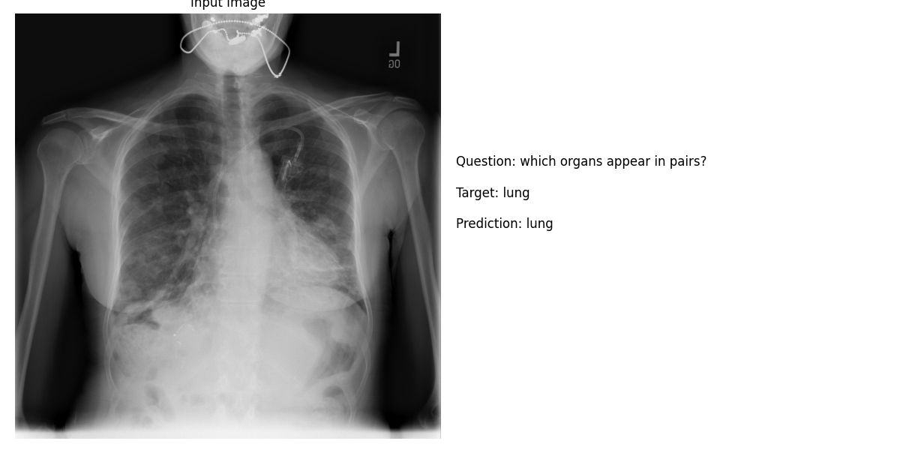
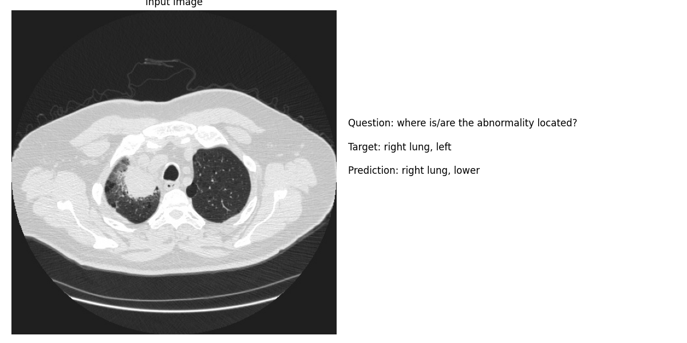

# Week Progress

**Date**: 2025-01-20 to 2025-01-31

## Overview

- A literature review of MLLMs and LMMs was conducted
- The DeepSeek Architecture was explored

### Review

- From 284 papers
- 168 were irrelevant leaving 116 MLLM or LMM Models across a range of tasks and domains

## Examples

## Accomplishments

Successfully tested the MLLM model on medical image dataset:
   - Achieved 73.4% overall accuracy
   - Strong performance on both CLOSED (74.0%) and OPEN (73.4%) questions
   - High BLEU scores indicating good response quality

## Plans for Next Week
